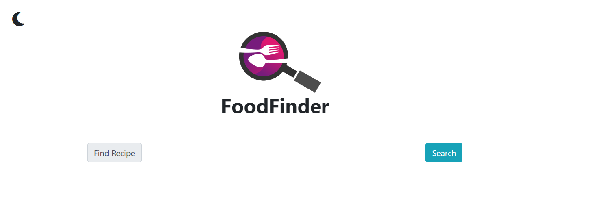

## Table of contents

- [Overview](#overview)
  - [The challenge](#the-challenge)
  - [Screenshot](#screenshot)
  - [Links](#links)
- [Authors](#author)

## Overview

### The challenge
* We decided to create something that will be both useful and funny
* Something that we all need? Food!
* Something that we never have enough? Laugh!
* When the two powers combine, they summon Earth's greatest champion, FoofFinder!

### While using fruits of our work
* You can search food recipes found on [www.edamam.com](https://www.edamam.com/)
* There may or may not be some [surprises](https://tenor.com/) waiting for you

### Screenshot

### Links

* You can see deployed FoodFinder [here](https://pixelfobia.github.io/Food-Recipe-Finder/)

## Authors
- KodeIva - [GitHub](https://github.com/KodeIva)
- Pixelfobia - [GitHub](https://github.com/Pixelfobia)
- Skwiera-Magic - [GitHub](https://github.com/Skwiera-Magic/)